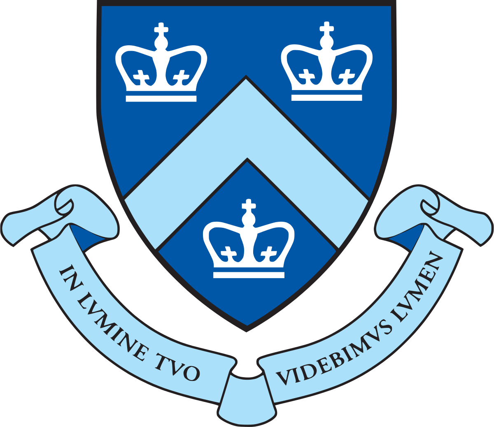

# Hi!

## About
My background is in creating full-stack applications in Python, and creating Client-Server applications in C. I'm currently working on a mobile application using React-Native.

| | | | |
|:--:|:--:|:--:|:--:|
| </img> | [Columbia University](https://www.columbia.edu/) | B.S. in Computer Science | 2022-2024 |
| </img> | [Claremont McKenna College](https://www.cmc.edu/) |  B.A. in Economics & Engineering | 2019-2022 |
